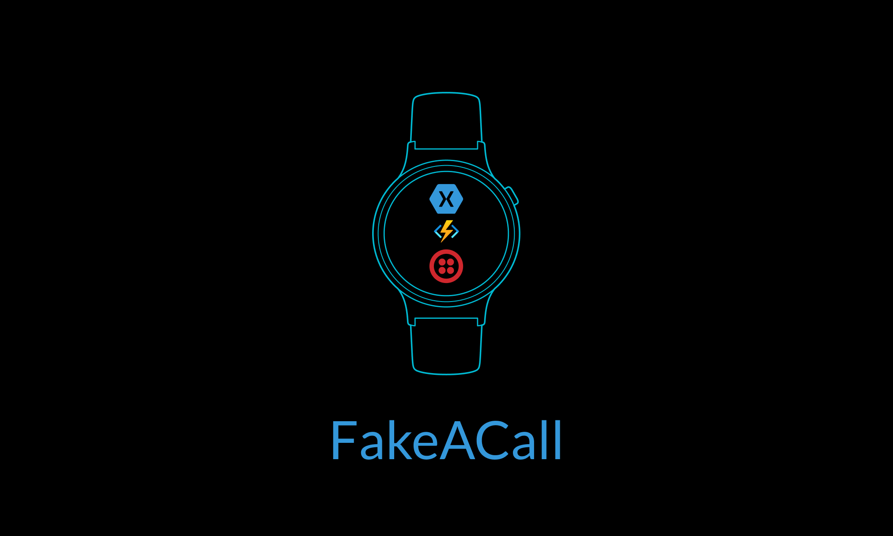

## FakeACall



---

### Description

**FakeACall** is a Android Wear application that allows the smartwatch owner to fake a phone call in order to get out of situations they may want to. It has been built using Xamarin.Android and uses an Azure Function and Twilio Programmable Voice to fake a phone call.

###  Components

* The [```main```](https://github.com/adityaoberai/FakeACall/tree/main) branch contains the **Xamarin.Android** project used to build the Android Wear OS app.  

* The [```twilio_function```](https://github.com/adityaoberai/FakeACall/tree/twilio_function) branch contains the **Azure Function** that uses **Twilio Programmable Voice** to fake a call.  

---

### Demo


